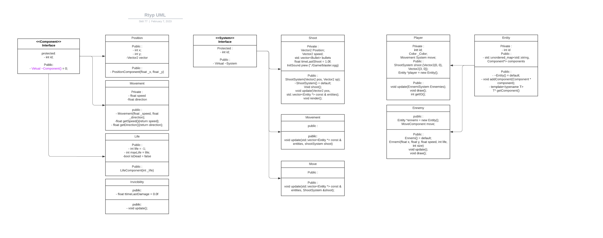

# R-Type

The goal of this project is to recreate the [R-Type](https://fr.wikipedia.org/wiki/R-Type) game with multiplayer mode. The goal is also do advanced features like a full game engine who can be use in another game like an RPG or an advanced networks with management in lag

This project is realise in [Raylib](https://www.raylib.com/), [Asio](https://think-async.com/Asio/Documentation.html) and [Nhlohmann_json](https://github.com/nlohmann/json)

Link to Github Projet:
https://github.com/orgs/EpitechPromo2025/projects/145

# Commit standard

The commit standard mentioned here is a set of guidelines for developers to follow when creating commit messages.
The format for a commit message should start with a type of commit in square brackets,
followed by a brief description of the change being made in the message.
He create the commit like this: <br>&nbsp;&nbsp;&nbsp;&nbsp;**[<em>ADD</em>] {message}**
                                <br>&nbsp;&nbsp;&nbsp;&nbsp;**[<em>FIX</em>] {message}**
                                <br>&nbsp;&nbsp;&nbsp;&nbsp;**[<em>DELETE</em>] {message}**

Before merging a pull request, you need 2 reviews on it.
This helps to maintain a clear and concise commit history and makes it easier for other developers to understand the changes made to the codebase over time.

# Installation

## Linux
To install conan and build the cmake, use this command:
```bash
conan install . --build=missing && cmake . -G "Unix Makefiles" && cmake --build .
```

or you can use the .sh file to:
```bash
./run.sh
```

# Server

To start the serve, use the command
```bash
./rtype_server
```

# Client

To start the client,
you can use this command ./rtype_client followed by the ip address:
```bash
./rtype_client 127.0.0.1
```

## Controller

**Player**

 Button        | Direction
 --------------|-------------
 Arrow Up      | Top
 Arrow Down    | Down
 Arrow Left    | Left
 Arrow Right   | Right
 Spacebar      | Shoot

# R-Type UML



## Protocol 

[Protocol](./doc/Protocol.md)

[Documentation html Doxygen](./doc/index.html)

## Creation of Entity

[Documentation](./doc/ConfigurationJSON.md)

## Authors

This project was made by:
 - [Chanh-Long Henry NGUYEN](https://github.com/clhenryng)
 - [Steve ZABANDITH](https://github.com/stevenzab)
 - [Loic PLANCHON](https://github.com/Loic-planchon)
 - [AXEL](https://github.com/Axel-B09)
 - [Danny DUONG](https://github.com/SkiliD)